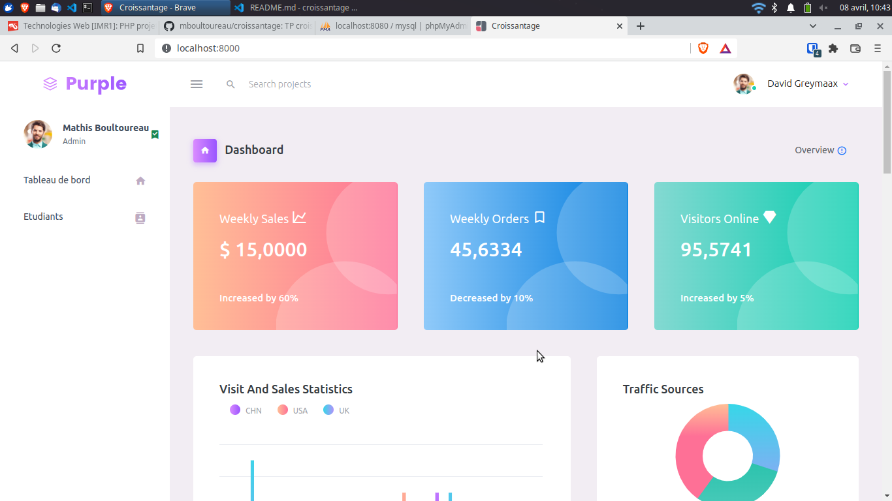
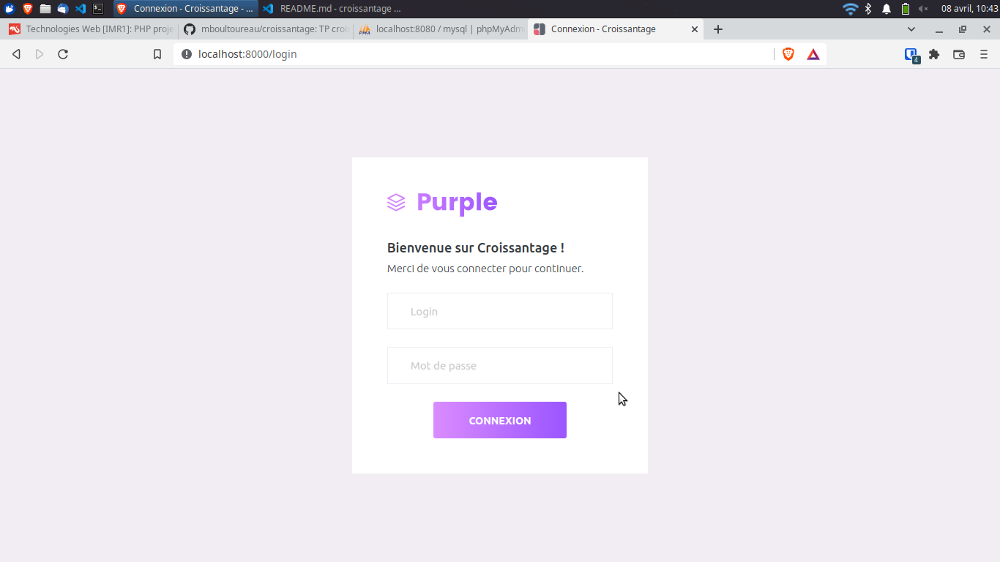
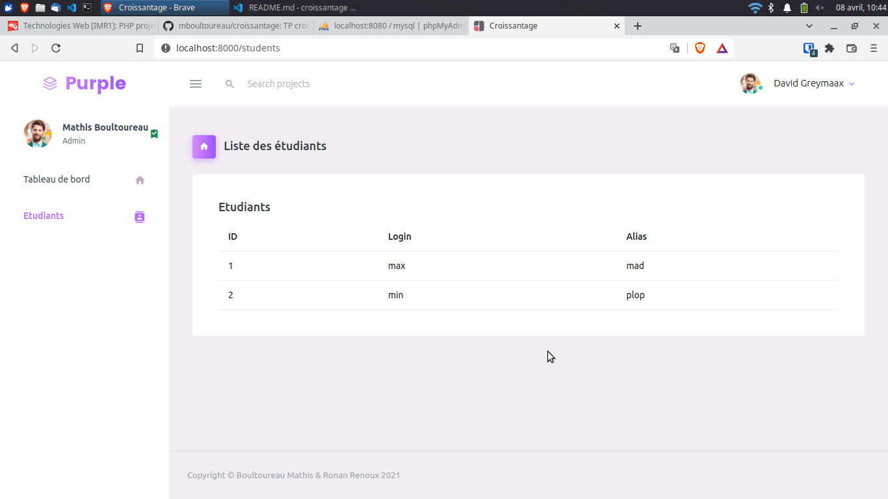

# TP Croissantage

Créé par [Mathis Boultoureau](https://github.com/mboultoureau) et [Ronan Renoux](https://github.com/ronanren)

## Avancement

- Installation de Slim 4
- Refaire l'arborescence à notre sauce (Controller / Entity / Repository / Templates)
- Mise en place d'un template
- Installation de Twig et création de templates (découpage des différentes parties de la page)
- Création d'une Entité Student
- Création d'un repository et connexion à la base de données
- Récupération et affichage des étudiants dans la base de données (`/students`)
- Design de la page de login (`/login`)

Toute l'architecture (Controller, Entity, Repository) est fonctionnelle, il n'y a plus
qu'à dupliquer ces fichiers pour chaque entité et les modifier.

## Pages

Page d'accueil


Page de connexion


Page des étudiants



## Installation

Installation des dépendances de Composer :

```bash
docker run --rm --interactive --tty --volume $PWD:/app composer install
```

Lancement du projet :

```bash
docker-compose up -d
```

Mise en place de la base de données :
- Dans PhpMyAdmin (`localhost:8080`), lancer le script `docker/database/database.sql` dans la base `app`.

Arrêt du projet :

```bash
docker-compose down
```
